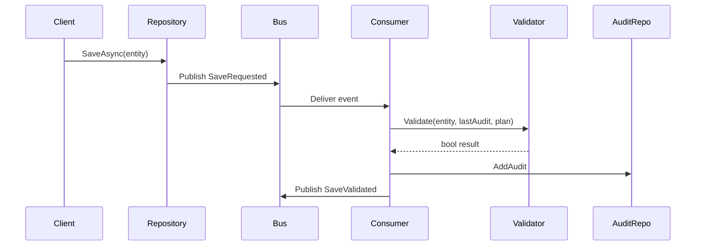

# RAGStart

RAGStart showcases an event‑driven validation workflow using .NET and MassTransit. The libraries are designed for reuse in other projects and come with unit and BDD tests.

## Quick Start

1. Install the [.NET 9 SDK](https://dotnet.microsoft.com/en-us/download).
2. Run `dotnet test` to build and execute all tests.
3. Optionally run `dotnet test --collect:"XPlat Code Coverage"` to verify coverage (should exceed 80%).
4. Launch the sample console app:
   ```bash
   dotnet run --project src/ExampleRunner
   ```
   The console logs show save events, validations and stored audits.

## Validation Workflow

Entity saves publish a `SaveRequested<T>` event. A `SaveValidationConsumer<T>` validates the save against a configurable `SummarisationPlan<T>` and records the result as a `SaveAudit`.



### Configuring a Summarisation Plan

A plan defines how to compute a numeric metric from an entity and what threshold is allowed between saves:

```csharp
services.AddSaveValidation<Order>(o => o.LineAmounts.Sum(), ThresholdType.PercentChange, 0.5m);
```
* `MetricSelector` computes the metric value (order total in this case).
* `ThresholdType` can be `RawDifference` or `PercentChange`.
* `ThresholdValue` sets the allowable change.

Override the plan later via `ISummarisationPlanStore`:

```csharp
var store = provider.GetRequiredService<ISummarisationPlanStore>();
store.AddPlan(new SummarisationPlan<Order>(o => o.LineAmounts.Sum(), ThresholdType.RawDifference, 100m));
```

### Example Runner

The `ExampleRunner` project wires the dependencies and shows the workflow end‑to‑end. Run the project and observe the console output for validation results. Inspect `ISaveAuditRepository` to review the stored audits.

### Example Worker Runner

`ExampleWorkerRunner` builds on the library with a dedicated worker. The worker
saves an entity three times: once with the initial values, again with values
within the threshold and finally with values that exceed the threshold.

```
Project setup
-------------
[Program] --> [ServiceCollection] --> [MassTransit Bus]
                        |
                        v
                  [ExampleWorker]
                        |
                        v
                  [Repository] --> [Validator] --> [AuditStore]
```

Run the example with:

```bash
dotnet run --project src/ExampleWorkerRunner
```

During execution the console prints the latest validation state after each save.
The process flow is illustrated below:

```
Worker run
----------
  SetInitial -> Save -> Valid
      |
      v
  SetWithin  -> Save -> Valid
      |
      v
  SetOutside -> Save -> Invalid
```

## Project Structure

- `src/ExampleLib` – reusable domain classes and infrastructure
- `src/ExampleRunner` – console sample using the library
- `src/MetricsPipeline.Core` – worker components used across samples
- `src/ExampleWorkerRunner` – runs the example worker end to end
- `src/ExampleData` – Entity Framework and MongoDB data layer
- `tests/ExampleLib.Tests` – unit and BDD tests verifying the workflow
- `docs` – guides such as the EF Core replication how‑to

For additional details on replicating the EF Core setup, read `docs/EFCoreReplicationGuide.md`.

## Database Setup

Applications can register their DbContext and repositories in one line:

```csharp
services.SetupDatabase<YourDbContext>("Server=.;Database=example;Trusted_Connection=True");
```

When using MongoDB you can initialize everything in a similar fashion:

```csharp
services.AddExampleDataMongo("mongodb://localhost:27017", "exampledb");
```

Alternatively register MongoDB with:

```csharp
services.SetupMongoDatabase("mongodb://localhost:27017", "exampledb");
```

MongoDB is supported through a parallel set of classes. Install the driver with:

```bash
dotnet add src/ExampleData package MongoDB.Driver
```

Create a MongoDB database and wire up the generic repository like so:

```csharp
var client = new MongoClient("mongodb://localhost:27017");
var database = client.GetDatabase("exampledb");
var uow = new MongoUnitOfWork(database, new MongoValidationService(database));
var repo = uow.Repository<YourEntity>();
```

The `SetupMongoDatabase` helper returns the same services ready for use:

```csharp
services.SetupMongoDatabase("mongodb://localhost:27017", "exampledb");
var repo = services.BuildServiceProvider()
    .GetRequiredService<IGenericRepository<YourEntity>>();
```

The helpers `AddExampleDataMongo` and `SetupMongoDatabase` register `MongoClient`,
`IMongoDatabase`, the validation service and unit of work automatically.

`SetupDatabase` configures the DbContext, validation service and generic repositories. Every repository works with the `Validated` soft delete filter enabled by default.

## Validation Helpers

`SetupValidation` is an alias of `AddSaveValidation` for configuring summarisation plans. Multiple entities can be registered:

```csharp
services.SetupValidation<TasMetrics>(m => m.Value.Average(), ThresholdType.PercentChange, 0.25m);
services.SetupValidation<TasAvailability>(a => a.Value.Average(), ThresholdType.Average, 1);
```

The latest summarised metric is stored in the `Nanny` table whenever entities are saved through the unit of work.

### Nanny Records

`Nanny` rows capture the last computed metric for each save along with the program name and a runtime identifier. This history can be inspected for audit or troubleshooting purposes.

## MongoDB Support

The `MongoGenericRepository`, `MongoUnitOfWork` and `MongoValidationService`
provide an alternative to Entity Framework when working with MongoDB. Each
repository operates on an `IMongoCollection<T>` and respects the `Validated`
flag for soft deletes. The unit of work records `Nanny` documents just like the
EF variant.

### Testing MongoDB Code

- Unit tests run against an in‑memory server provided by **Mongo2Go** so no
  external database is required.
- `MongoRepositoryTests` verifies CRUD operations using this lightweight server.
- BDD scenarios in `MongoRepository.feature` and `MongoSoftDelete.feature`
  exercise the same behavior through Reqnroll steps.
- To explore the in‑memory server yourself, inspect the `MongoRepoSteps`
  definition under `tests/ExampleLib.BDDTests`.
- The MongoDB driver API is documented at
  [mongodb.github.io/mongo-csharp-driver](https://mongodb.github.io/mongo-csharp-driver/).

## Generating Validation Plans

A `ValidationPlan` describes how to validate an entity using a metric strategy. The default
implementation relies on the count of records.

Use `ValidationPlanFactory.CreatePlans<T, V>(connectionString)` to instantiate the
`DbContext` of type `V` and build a plan for each property type on `T`.

```csharp
var plans = ValidationPlanFactory.CreatePlans<MyComposite, YourDbContext>(
    "DataSource=:memory:");
```

If `MyComposite` has properties `Foo`, `Bar` and `Car`, three count based plans
are returned. The plans can be fed into `IValidationService` to compute counts
across tables.

### Codex Tasks

Running `dotnet test` now also exercises the validation plan factory scenario.
Convenient VS Code tasks are provided under `.vscode/tasks.json` for quick
execution from the Codex interface.
