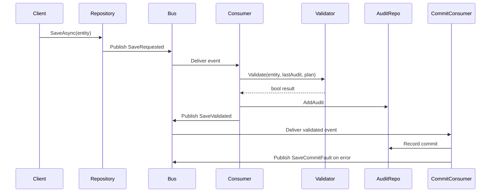

# RAGStart

RAGStart showcases an event‑driven validation workflow using .NET and MassTransit. The libraries are designed for reuse in other projects and come with unit and BDD tests.

`ExampleData` has been merged into `ExampleLib` so a single package now
provides both the domain logic and data layer.

## Quick Start

1. Install the [.NET 9 SDK](https://dotnet.microsoft.com/en-us/download).

2. Run `dotnet build` to compile all projects.
3. Run `dotnet test` to execute the unit and BDD tests.
4. Optionally run `dotnet test --collect:"XPlat Code Coverage"` to verify coverage (should exceed 80%).
5. Reference `ExampleLib` from your own application to explore the validation
   workflow. The previous `MetricsPipeline.Core` helpers were removed so the
   library now stands alone.
6. Execute the `run tests` task in VS Code to verify everything locally.
7. Use `AddSetupValidation` to configure the data layer and a default plan in a single statement.
8. Call `AddValidatorService` to enable manual rule checks during startup.
9. Register `SaveCommitConsumer` using `AddSaveCommit` to audit committed saves.
10. Use `SaveChangesWithPlanAsync` to automatically apply registered summarisation plans when saving entities.
11. Mongo repositories now trigger validation automatically via an interceptor so you rarely call `SaveChanges` yourself.
12. Configure complex validation plans using `AddValidationFlows` and a JSON file.
13. Use `MetricProperty`, `ThresholdType` and `ThresholdValue` keys to fine tune each registered entity.

## Event-Driven Demo

Previous revisions included a small demo showcasing two services
communicating over a bus. The code has been removed to streamline the
repository, but the documentation remains for historical context.
Use the library in your own worker or web project to replicate the
behaviour.

8. Register `AddDeleteValidation` or `AddDeleteCommit` to handle delete events.
## Validation Workflow

Entity saves publish a `SaveRequested<T>` event. A `SaveValidationConsumer<T>` validates the save against a configurable `SummarisationPlan<T>` and records the result as a `SaveAudit`.



## Delete Workflow

Deletes follow a similar event pattern:

1. A `DeleteRequested<T>` event is published when an entity should be removed.
2. `DeleteValidationConsumer<T>` checks any manual rules and emits `DeleteValidated<T>`.
3. If validated, `DeleteCommitConsumer<T>` publishes a `DeleteCommitted<T>` event.
4. Service registration helpers `AddDeleteValidation<T>` and `AddDeleteCommit<T>` wire the consumers.
5. Tests in `DeleteFlowTests` demonstrate the full validation and commit sequence.

### Configuring a Summarisation Plan

A plan defines how to compute a numeric metric from an entity and what threshold is allowed between saves:

```csharp
services.AddSaveValidation<Order>(o => o.LineAmounts.Sum(), ThresholdType.PercentChange, 0.5m);
```
* `MetricSelector` computes the metric value (order total in this case).
* `ThresholdType` can be `RawDifference` or `PercentChange`.
* `ThresholdValue` sets the allowable change and is easily tuned per entity.
* These settings can also be supplied in a JSON file when using `AddValidationFlows`.
* Audits of each save are stored in a `SaveAudit` table derived from `BaseEntity` so every entry has an integer key and validation flag.

Override the plan later via `ISummarisationPlanStore` to tweak validation logic without recompiling:

```csharp
var store = services.BuildServiceProvider().GetRequiredService<ISummarisationPlanStore>();
store.AddPlan(new SummarisationPlan<YourEntity>(e => e.Id, ThresholdType.RawDifference, 1));
```
Manual rules can also run during startup via `AddValidatorService` so configuration issues are caught early.


## Setup Validation

`SetupValidation` performs a three phase configuration that mirrors the production startup. It adds basic framework services, registers the selected EF Core provider and optionally configures an `HttpClient` for validation routines.

```csharp
services.SetupValidation(o =>
{
    o.ConfigureDb = b => b.UseInMemoryDatabase("check");
    o.ConfigureClient = (_, c) => c.Timeout = TimeSpan.FromSeconds(5);
});
```

Custom validators can then be registered via `AddSetupValidation<T>` and resolve any configured clients or contexts:

```csharp
services.AddSetupValidation<MyStartupValidator>();
```

Validators derived from `SetupValidator` execute against the service provider so common setup logic is reusable across projects.

## Commit Auditing

`SaveCommitConsumer` listens for `SaveValidated<T>` events and records a final `SaveAudit`. If persistence fails a `SaveCommitFault<T>` message is published. Register the consumer via `services.AddSaveCommit<T>()`.
## Reliability Features

MassTransit now enables automatic retries and an in-memory outbox on every endpoint.
Poison messages are moved to a dedicated dead letter queue and logged via **Serilog**.
OpenTelemetry tracing captures bus activity so message flow can be observed.

```csharp
services.AddSaveValidation<Order>(o => o.LineAmounts.Sum());

Log.Logger = new LoggerConfiguration()
    .Enrich.FromLogContext()
    .WriteTo.Console()
    .CreateLogger();
```

The configuration above wires `UseMessageRetry`, `UseInMemoryOutbox` and a Serilog
receive observer. Failed messages appear in `save_requests_queue_error` and are
written to the console.


## Architecture Overview

At a high level the pipeline flows through a fixed sequence of services coordinated by the `PipelineOrchestrator`:

```
 [GatherService] -> [SummarizationService] -> [ValidationService] -> [CommitService]
                                                          |
                                                          v
                                                  [DiscardHandler]
```
```

### Example Runner

The `ExampleRunner` project wires the dependencies and shows the workflow end‑to‑end. Run the project and observe the console output for validation results. Inspect `ISaveAuditRepository` to review the stored audits. The runner now registers `SaveCommitConsumer` so committed saves are audited too.
The `ExampleRunner` project wires the dependencies and shows the workflow end‑to‑end. Run the project and observe the console output for validation results. Inspect `ISaveAuditRepository` to review the stored audits.
The runner now stores audits in a database when `AddSetupValidation` is used,
demonstrating how metrics persist between runs. Retrieve the latest audit like
so:
```csharp
var last = provider.GetRequiredService<ISaveAuditRepository>()
    .GetLastAudit("Order", "ORDER123");
```

### Example Worker Runner

Earlier revisions included a small worker host for experimentation. The project
and supporting `MetricsPipeline.Core` library have been deleted to streamline
the repository. You can still build your own worker by referencing `ExampleLib`
directly.

## Project Structure

- `src/ExampleLib` – reusable domain classes and infrastructure. The data layer
  has been merged into this project so consumers only reference a single
  library.
- `tests/ExampleLib.Tests` – unit tests covering repository and validation logic.
- `tests/ExampleLib.BDDTests` – BDD scenarios demonstrating end‑to‑end flows.
- `docs` – guides such as the EF Core replication how‑to.

For additional details on replicating the EF Core setup, read `docs/EFCoreReplicationGuide.md`.

## Database Setup

Applications can register their DbContext and repositories in one line:

```csharp
services.SetupDatabase<YourDbContext>("Server=.;Database=example;Trusted_Connection=True");
```

The setup now registers an `EfSaveAuditRepository` that persists `SaveAudit`
records using Entity Framework Core. When MongoDB is configured the
equivalent `MongoSaveAuditRepository` is wired instead.
Run `dotnet ef migrations add AddSaveAudit` to generate the initial migration
and update the database.

When using MongoDB you can initialize everything in a similar fashion:

```csharp
services.AddExampleDataMongo("mongodb://localhost:27017", "exampledb");
```

Alternatively register MongoDB with:

```csharp
services.SetupMongoDatabase("mongodb://localhost:27017", "exampledb");
```

MongoDB is supported through a parallel set of classes. Install the driver with:

```bash
dotnet add src/ExampleData package MongoDB.Driver
```

Create a MongoDB database and wire up the generic repository like so:

```csharp
var client = new MongoClient("mongodb://localhost:27017");
var database = client.GetDatabase("exampledb");
var planStore = new InMemorySummarisationPlanStore();
planStore.AddPlan(new SummarisationPlan<YourEntity>(e => e.Id, ThresholdType.RawDifference, 1));
var uow = new MongoUnitOfWork(database, new MongoValidationService(database), planStore);
var repo = uow.Repository<YourEntity>();
```

The `SetupMongoDatabase` helper returns the same services ready for use:

```csharp
services.SetupMongoDatabase("mongodb://localhost:27017", "exampledb");
var repo = services.BuildServiceProvider()
    .GetRequiredService<IGenericRepository<YourEntity>>();
```

Both helpers expect an `ISummarisationPlanStore` to be registered so `UnitOfWork` can resolve plans when saving.

`AddSetupValidation` uses the same builder under the hood. When `UseMongo` is chosen the
`MongoSaveAuditRepository` replaces the EF implementation automatically.

The helpers `AddExampleDataMongo` and `SetupMongoDatabase` register `MongoClient`,
`IMongoDatabase`, the validation service and unit of work automatically.

`SetupDatabase` configures the DbContext, validation service and generic repositories. Every repository works with the `Validated` soft delete filter enabled by default.

### SetupValidationBuilder
Use this fluent helper to collect configuration steps before applying them.
It keeps your setup code compact and environment agnostic.

```csharp
var builder = new SetupValidationBuilder()
    .UseSqlServer<YourDbContext>("DataSource=:memory:");
builder.Apply(services);

`EfSaveAuditRepository` is registered automatically when a SQL database is
configured, so calling `GetLastAudit` later will query the table instead of the
in-memory store.
Likewise `UseMongo` registers `MongoSaveAuditRepository` so audits are persisted
to your MongoDB instance.
```

`UseMongo` can be substituted to register MongoDB instead. Chaining these calls keeps startup code tidy when switching providers.

## Validation Helpers

`SetupValidation` now accepts a lambda to configure the `SetupValidationBuilder`.
Call it once during startup to set up the data layer:

```csharp
services.SetupValidation(b => b.UseSqlServer<YourDbContext>("DataSource=:memory:"));
```

After configuring the infrastructure you can register multiple plans using `AddSaveValidation`:

```csharp
services.AddSaveValidation<TasMetrics>(m => m.Value.Average(), ThresholdType.PercentChange, 0.25m);
services.AddSaveValidation<TasAvailability>(a => a.Value.Average(), ThresholdType.Average, 1);
```
Both helpers return the service collection, so configuration can be chained fluently:

```csharp
services.SetupValidation(b => b.UseMongo("mongodb://localhost:27017", "demo"))
        .AddSaveValidation<Order>(o => o.LineAmounts.Sum());
```
You can also perform both steps in one call using `AddSetupValidation`:

```csharp
services.AddSetupValidation<Order>(
    b => b.UseSqlServer<YourDbContext>("DataSource=:memory:"),
    o => o.LineAmounts.Sum());
```

### ValidationRuleSet

`ValidationRuleSet` groups multiple `ValidationRule` instances using a shared metric selector.
Pass a rule set to `UnitOfWork.SaveChangesAsync` when several thresholds must be
checked at once:

```csharp
var rules = new ValidationRuleSet<YourEntity>(e => e.Id,
    new ValidationRule(ValidationStrategy.Count, 1),
    new ValidationRule(ValidationStrategy.Sum, 1));
await uow.SaveChangesAsync(rules);
```
This overload validates the entity only when **all** rules are satisfied. The
last computed metric is still recorded in the `Nanny` table for auditing.

The latest summarised metric is stored in the `Nanny` table whenever entities are saved through the unit of work.

### Saving With Plans

`SaveChangesWithPlanAsync<TEntity>()` looks up the registered `SummarisationPlan` for the entity type and automatically applies it. The plan selector, strategy and threshold are forwarded to the existing validation logic.

```csharp
await uow.SaveChangesWithPlanAsync<YourEntity>();
```
Inject `ISummarisationPlanStore` when constructing a unit of work so plans can be resolved on demand.

### Manual Validation Service

`ManualValidatorService` runs simple predicates registered per type. Use it when
summarisation plans are overkill or you want quick checks. Call
`AddValidatorService` during startup and register predicates with
`AddValidatorRule`:

```csharp
var services = new ServiceCollection();
services.AddValidatorService()
        .AddValidatorRule<Order>(o => o.Total > 0);
var validator = services.BuildServiceProvider()
    .GetRequiredService<IManualValidatorService>();
bool ok = validator.Validate(new Order());
```

- Rules are stored in a dictionary keyed by runtime type.
- When no rules exist validation succeeds by default.
- Every rule for the type must return `true` for the instance to be valid.
- Inject the rule dictionary via the constructor for testability.
- Register rules easily with `AddValidatorRule`.
- Retrieve the rule dictionary from DI for inspection or updates.
- The extension methods keep startup code concise.
- BDD tests under `ManualValidatorService.feature` cover these scenarios.

### Nanny Records

`Nanny` rows capture the last computed metric for each save along with the program name and a runtime identifier. This history can be inspected for audit or troubleshooting purposes.

## MongoDB Support

The `MongoGenericRepository`, `MongoUnitOfWork` and `MongoValidationService`
provide an alternative to Entity Framework when working with MongoDB. Each
repository operates on an `IMongoCollection<T>` and respects the `Validated`
flag for soft deletes. The unit of work records `Nanny` documents just like the
EF variant.

### Automatic Validation

`MongoGenericRepository` now uses `MongoCollectionInterceptor` to call
`MongoUnitOfWork.SaveChangesWithPlanAsync` whenever a document is inserted or
updated. Nanny entries are written automatically without additional code.

Register the interceptor by calling `AddExampleDataMongo` or
`SetupMongoDatabase` which wires the generic type for you.
The interceptor implements `IMongoCollectionInterceptor<T>` so custom behaviour
can be swapped in if needed.

```csharp
services.SetupMongoDatabase("mongodb://localhost:27017", "exampledb");
var repo = provider.GetRequiredService<IGenericRepository<YourEntity>>();
await repo.AddAsync(new YourEntity()); // validation runs automatically
```
You can still invoke `SaveChangesWithPlanAsync` manually after bulk operations
to recompute metrics on demand.

### Testing MongoDB Code

- Unit tests run against an in‑memory server provided by **Mongo2Go** so no
  external database is required.
- `MongoRepositoryTests` verifies CRUD operations using this lightweight server.
  - BDD scenarios in `MongoRepository.feature` and `MongoSoftDelete.feature`
    exercise the same behavior through Reqnroll steps. Demo features have been
    removed so tests now focus entirely on EF Core and MongoDB validation.
  - To explore the in‑memory server yourself, inspect the `MongoRepoSteps`
    definition under `tests/ExampleLib.BDDTests`.
- `MongoInterceptorTests` demonstrates automatic validation for inserts and updates.
- The MongoDB driver API is documented at
  [mongodb.github.io/mongo-csharp-driver](https://mongodb.github.io/mongo-csharp-driver/).

## Generating Validation Plans

A `ValidationPlan` describes how to validate an entity using a metric strategy. The default
implementation relies on the count of records.
`UnitOfWork` now depends on `ISummarisationPlanStore` so the generated plans can be applied when persisting entities.

Use `ValidationPlanFactory.CreatePlans<T, V>(connectionString)` to instantiate the
`DbContext` of type `V` and build a plan for each property type on `T`.

```csharp
var plans = ValidationPlanFactory.CreatePlans<MyComposite, YourDbContext>(
    "DataSource=:memory:");
```

If `MyComposite` has properties `Foo`, `Bar` and `Car`, three count based plans
are returned. The plans can be fed into `IValidationService` to compute counts
across tables.

### Codex Tasks

Running `dotnet test` now also exercises the validation plan factory scenario.
Convenient VS Code tasks are provided under `.vscode/tasks.json` for quick
execution from the Codex interface. Tasks exist for running all tests,
validating the plan factory and the new setup validation scenario.
An additional task runs the `AddValidatorService` feature to verify manual rules.

## Plan 2 Repository + Unit of Work Sample

Earlier versions contained a second sample under `samples/Plan2RepositoryUoW`.
It has been removed to simplify the repository. The documentation is retained
for reference should you wish to build a similar setup using the merged
`ExampleLib` project.
Inspect the `Nanny` table using the EF in-memory API to see audit entries.

## Troubleshooting

If tests or demos fail to run, review these suggestions:

- Set `DOTNET_ROLL_FORWARD=Major` when running .NET 9 on older apps.
- Run `dotnet restore` to pull missing packages.
- Ignore MassTransit outbox warnings in demo projects.
- Remove `bin` and `obj` folders after SDK upgrades to avoid stale builds.
- Use `--no-restore` and `--no-build` flags for quick test iterations.


## External Flow Configuration

Validation flows can be defined in a JSON file and loaded at runtime. The file may contain a single object or an array of objects. Each entry specifies the entity type and which flows to enable.

```json
[
  {
    "Type": "ExampleData.YourEntity, ExampleData",
    "SaveValidation": true,
    "MetricProperty": "Id",
    "ThresholdType": "RawDifference",
    "ThresholdValue": 2
  }
]
```

Load the file and register the flows during startup:

```csharp
var json = File.ReadAllText("flows.json");
var options = ValidationFlowOptions.Load(json);
services.AddValidationFlows(options);
```
This approach lets you adjust validation logic without recompiling the application. Each entry now supports `MetricProperty`, `ThresholdType` and `ThresholdValue` so you can fine tune plans in configuration. Both unit tests and BDD scenarios cover the configuration loader and plan creation.
