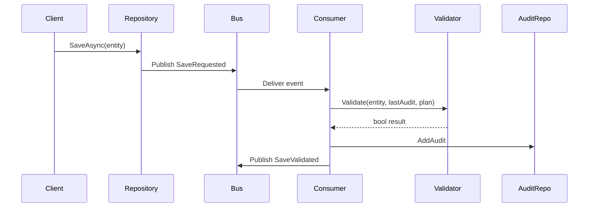

# RAGStart

RAGStart showcases an event‑driven validation workflow using .NET and MassTransit. The libraries are designed for reuse in other projects and come with unit and BDD tests.

## Quick Start

1. Install the [.NET 9 SDK](https://dotnet.microsoft.com/en-us/download).
2. Run `dotnet test` to build and execute all tests.
3. Optionally run `dotnet test --collect:"XPlat Code Coverage"` to verify coverage (should exceed 80%).
4. Launch the sample console app:
   ```bash
   dotnet run --project src/ExampleRunner
   ```
   The console logs show save events, validations and stored audits.

## Validation Workflow

Entity saves publish a `SaveRequested<T>` event. A `SaveValidationConsumer<T>` validates the save against a configurable `SummarisationPlan<T>` and records the result as a `SaveAudit`.



### Configuring a Summarisation Plan

A plan defines how to compute a numeric metric from an entity and what threshold is allowed between saves:

```csharp
services.AddSaveValidation<Order>(o => o.LineAmounts.Sum(), ThresholdType.PercentChange, 0.5m);
```
* `MetricSelector` computes the metric value (order total in this case).
* `ThresholdType` can be `RawDifference` or `PercentChange`.
* `ThresholdValue` sets the allowable change.

Override the plan later via `ISummarisationPlanStore`:

```csharp
var store = provider.GetRequiredService<ISummarisationPlanStore>();
store.AddPlan(new SummarisationPlan<Order>(o => o.LineAmounts.Sum(), ThresholdType.RawDifference, 100m));
```

### Example Runner

The `ExampleRunner` project wires the dependencies and shows the workflow end‑to‑end. Run the project and observe the console output for validation results. Inspect `ISaveAuditRepository` to review the stored audits.

## Project Structure

- `src/ExampleLib` – reusable domain classes and infrastructure
- `src/ExampleRunner` – console sample using the library
- `tests/ExampleLib.Tests` – unit and BDD tests verifying the workflow
- `docs` – guides such as the EF Core replication how‑to

For additional details on replicating the EF Core setup, read `docs/EFCoreReplicationGuide.md`.
